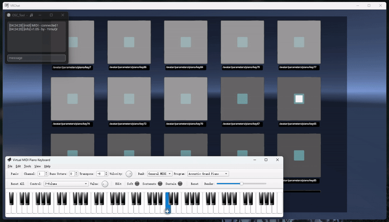

<h2 align="center"> ✨ OSC_Tool ✨ </h2>

```zsh
> A compact OSC tool suitable for VRChat ⭐
```


```zsh
> /help          --  Help

> /midi s        --  Scan MIDI devices
> /midi c        --  Connect first MIDI
> /midi c [ ]    --  Custom MIDI connection
> /midi d        --  Disconnect MIDI device

> /osc s         --  Start OSC scan server
> /osc d         --  Shutdown OSC server
> /osc t         --  OSC address test

> /open vrc      --  Open VRChat
> /kill vrc      --  Taskkill VRChat

> /exit          --  Exit
```

<h2 align="center"> </h2>

```zsh
> OSC_Tool - TTT ⭐
```

<h2 align="center"> </h2>

```zsh
> OSC_Tool - OSC Search ⭐
```

<h2 align="center"> </h2>

```zsh
> OSC_Tool - OSC Output Test ⭐
```

<h2 align="center"> </h2>

```zsh
> OSC_Tool - OSC MIDI ⭐
```

<h2 align="center"> </h2>

```zsh
> Parameter 🗝️
```

<h2 align="center"> </h2>

`/avatar/parameters/piano/key_s` OSC_MIDI 的地址 `s` 为note为地址,  琴键按下为`True` 抬起为`False`


`/avatar/parameters/Message_Box` When sending a message via TTT, this parameter will be sent as `True` for 0.5 seconds, which can be used as animation and sound effects when sending a message.

`/avatar/parameters/key/P_1`, `/avatar/parameters/key/P_2`, `/avatar/parameters/key/P_3` 密钥发送的地址 可以用作公开头像的加密措施

`C:\Users\You\AppData\LocalLow\VRChat\VRChat` 密钥所在的目录


<h2 align="center"> 🧡 END 🧡 </h2>
