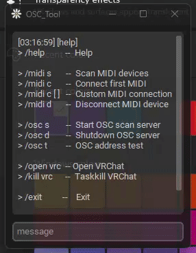
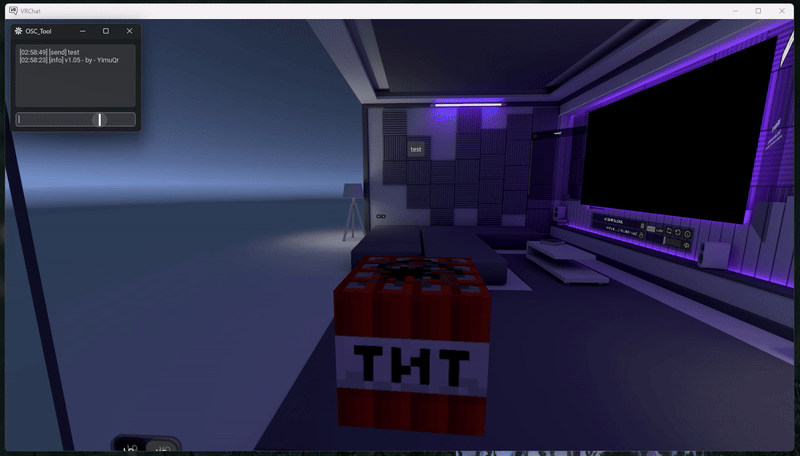

<h2 align="center"> ✨ OSC_Tool ✨ </h2>

```zsh
> A compact OSC tool suitable for VRChat ⭐
```



```zsh
> /help          --  Help

> /midi s       --  Scan MIDI devices
> /midi c       --  Connect first MIDI
> /midi c [ ]   --  Custom MIDI connection
> /midi d       --  Disconnect MIDI device

> /osc s        --  Start OSC scan server
> /osc d        --  Shutdown OSC server
> /osc t         --  OSC address test

> /open vrc  -- Open VRChat
> /kill vrc      --  Taskkill VRChat

> /exit          --    Exit
```

```zsh
> TTT ⭐
```

